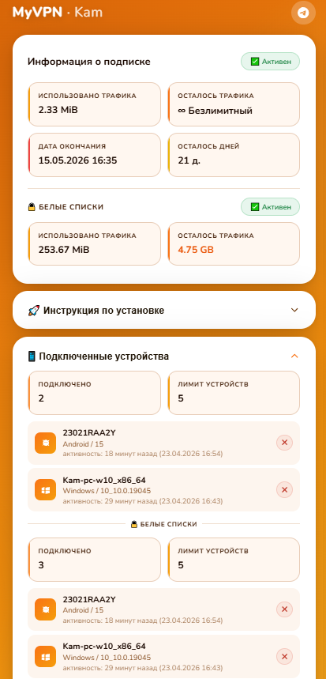

# remna_sub_panel

PHP пользовательская панель для подписок [Remnawave](https://github.com/remnawave).

Открывается в браузере — показывает карточку с информацией о подписке (трафик, срок, устройства).  
Открывается в Happ — проксирует подписку с поддержкой HWID, слияния с WL-подпиской и кастомных заголовков.  
Поддерживает подмену тела подписки для заблокированных/просроченных пользователей.



## Возможности

- Браузерная панель: трафик, срок, статус, HWID-устройства, белые списки
- Проксирование подписки для Happ с фильтрацией и переопределением заголовков
- Поддержка форматов подписки: **base64 (text/plain)** и **JSON**
- Слияние основной подписки и WL-подписки (`{uuid}{wl_suffix}`) в один ответ
- Подмена тела подписки для статусов LIMITED / EXPIRED / DISABLED
- Настраиваемые шаблоны страниц (папка `templates/`)
- Шифрование ссылок через [crypto.happ.su](https://crypto.happ.su)
- Debug-панель для диагностики (доступна только с заданного IP)
- Поддержка Apache (`.htaccess`) и Nginx

## Требования

- PHP **8.1+** с расширением `ext-curl`
- Apache или Nginx
- Доступ к панели [Remnawave](https://github.com/remnawave)

## Установка

### 1. Скопируй файлы на сервер

```bash
git clone https://github.com/goldns/remna_sub_panel.git /var/www/sub
```

### 2. Создай конфиг

```bash
cp config.php.example config.php
```

Открой `config.php` и заполни обязательные поля:

```php
'remnawave_url' => 'https://your-remnawave-panel.com',
'api_token'     => 'ваш_api_токен',  // Remnawave → Settings → API Tokens
```

### 3. Настрой веб-сервер

**Nginx** — отредактируй `nginx.conf`, замени `server_name` и путь `root`, затем подключи:

```bash
cp nginx.conf /etc/nginx/sites-available/sub
ln -s /etc/nginx/sites-available/sub /etc/nginx/sites-enabled/
nginx -t && systemctl reload nginx
```

> Путь к сокету PHP-FPM по умолчанию: `unix:/run/php/php8.4-fpm.sock`  
> Для другой версии PHP замени на `php8.x-fpm.sock`

**Apache** — `.htaccess` уже лежит в корне, mod_rewrite должен быть включён:

```bash
a2enmod rewrite
systemctl reload apache2
```

## Конфигурация

Все настройки — в файле `config.php`. Основные параметры:

| Параметр | По умолчанию | Описание |
|---|---|---|
| `remnawave_url` | — | URL панели Remnawave (без слеша в конце) |
| `api_token` | — | API-токен из Remnawave Dashboard |
| `project_name` | `null` | Название в шапке страницы (`null` = скрыть) |
| `show_qr` | `false` | Показывать кнопку QR-кода |
| `copyright` | `null` | Текст копирайта в футере (`{year}` = текущий год) |
| `encrypt_sub_link` | `true` | Шифровать deeplink через crypto.happ.su |
| `support_url` | `null` | Ссылка на поддержку (Telegram и др.) |
| `lang` | `'ru'` | Язык интерфейса |
| `template` | `'default'` | Папка шаблонов внутри `/templates/` |
| `debug_ip` | `''` | IP для доступа к debug-панели (пусто = отключено) |
| `display_errors` | `false` | Показывать ошибки PHP клиенту |

### WL-подписки

Пользователь с суффиксом к shortUuid (`{uuid}_WL` по умолчанию) содержит дополнительные серверы. Его тело сливается с основным ответом.

| Параметр | По умолчанию | Описание |
|---|---|---|
| `wl_suffix` | `'_WL'` | Суффикс к shortUuid для WL-пользователя |
| `enable_wl` | `true` | `false` = WL-запрос не делается, тела не сливаются |

### Подмена тела при неактивных статусах

Если пользователь заблокирован или исчерпал лимиты, можно подменить содержимое его подписки. Тело подменного пользователя **сливается** с телом оригинального (как WL), заголовки (трафик, срок) остаются от оригинала.

| Параметр | Статус | Описание |
|---|---|---|
| `user_limited` | `LIMITED` | Трафик закончился |
| `user_expired` | `EXPIRED` | Срок подписки истёк |
| `user_disabled` | `DISABLED` | Отключён администратором |

Значение — **shortUuid** подменного пользователя. Пустая строка `''` = подмена отключена.

```php
'user_limited'  => 'abc123',
'user_expired'  => 'abc123',
'user_disabled' => 'abc123',
```

### Переопределение заголовков Happ

Параметры `profile_title`, `support_url`, `announce`, `profile_update_interval`, `content_disposition_name`:
- `null` — пропустить значение Remnawave без изменений
- `'строка'` — заменить своим значением
- `''` — удалить заголовок полностью

Параметр `happ_routing` — routing-профиль (`null` = не переопределять):
- Полный URL вида `happ://routing/add/{base64}` или `happ://routing/onadd/{base64}`
- **text/plain подписка** — вставляется первой строкой в тело
- **JSON подписка** — передаётся заголовком `routing`
- Заголовок `routing` от Remnawave при этом подавляется автоматически

### Кастомные заголовки

```php
'custom_headers' => [
    'ping-type'     => 'proxy',
    'hide-settings' => 1,
    // ...
],
```

Отправляются **только Happ-клиентам**, браузер их не получает.

### Шаблоны

Для создания своей темы скопируй `templates/default/` в `templates/my-theme/` и укажи в конфиге:

```php
'template' => 'my-theme',
```

Папка должна содержать те же 5 файлов: `user-panel.php`, `error-page.php`, `debug-panel.php`, `happ-debug.php`, `install-guide.php`.

## Структура URL

```
https://your-domain.com/{shortUuid}
```

- Браузер → панель пользователя
- Happ + X-HWID → подписка (JSON или base64 — зависит от настроек Remnawave)
- Happ без X-HWID → 403

## Автор

[@kamgoldns](https://t.me/kamgoldns)

## Лицензия

MIT
