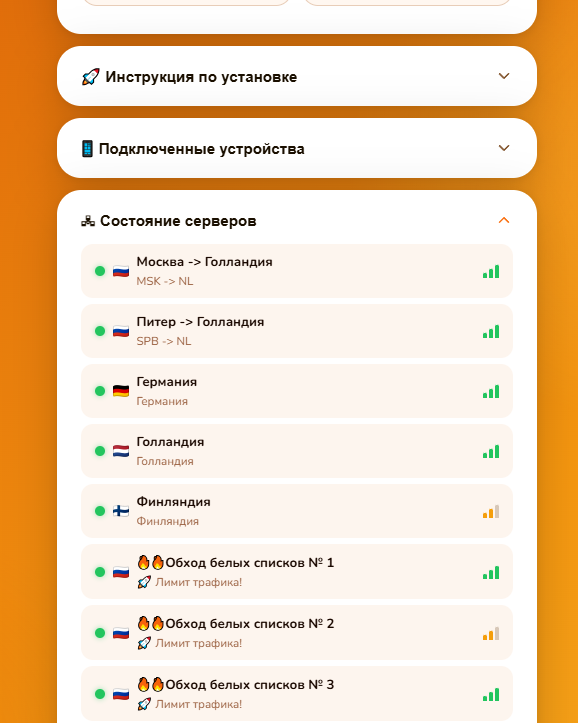
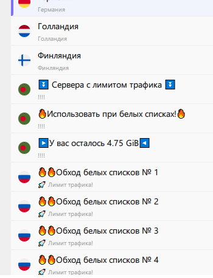
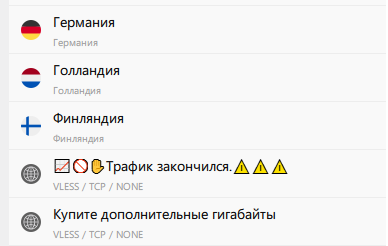
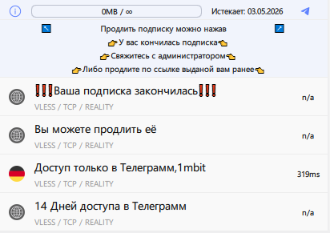

# remna_sub_panel

PHP пользовательская панель для подписок [Remnawave](https://github.com/remnawave).

Открывается в браузере — показывает карточку с информацией о подписке (трафик, срок, устройства).  
Открывается в Happ — проксирует подписку с поддержкой HWID, слияния с WL-подпиской и кастомных заголовков.  
Поддерживает подмену тела подписки для заблокированных/просроченных пользователей.










## Возможности

- Браузерная панель: трафик, срок, статус, HWID-устройства, белые списки
- Блок **«Состояние серверов»** в браузерной панели: онлайн/офлайн, задержка, флаги стран, описание — через xray-checker API
- Проксирование подписки для Happ с фильтрацией и переопределением заголовков
- Поддержка форматов подписки: **base64 (text/plain)** и **JSON**
- Слияние основной подписки и WL-подписки (`{uuid}{wl_suffix}`) в один ответ (только для активных пользователей)
- Перемешивание серверов основной подписки при каждом запросе (Fisher-Yates, только ACTIVE, не затрагивает WL)
- Подмена тела подписки для статусов LIMITED / EXPIRED / DISABLED (WL при этом не применяется)
- Статус-специфичные `announce` — разные объявления для limited / expired / disabled
- Поддержка **внешних чекеров** (xray-checker и др.) — по IP/UA отдают Happ-ответ вместо HTML
- Кнопки оплаты в шапке панели: **«Продлить»** (сайт) и **«Продлить в Телеграмм»** (TG-бот) с настраиваемым URL-шаблоном (`{shortUuid}`, `{uuid}`, `{B64:USERNAME}`)
- Удаление HWID-устройств прямо из браузерной панели
- APCu-кэш браузерных запросов к Remnawave API (снижает нагрузку)
- Настраиваемые шаблоны страниц (папка `templates/`)
- Шифрование ссылок через [crypto.happ.su](https://crypto.happ.su)
- Debug-панель для диагностики (доступна только с заданного IP)
- Поддержка Apache (`.htaccess`) и Nginx
- Поддержка eGames панелей - переменная `egames_cookie`

## Требования

- PHP **8.1+** с расширениями `ext-curl`, `ext-mbstring`
- Apache или Nginx
- Доступ к панели [Remnawave](https://github.com/remnawave)
- Для HWID-функций и удаления устройств: **API-токен** из Remnawave Dashboard (для других задач токен не нужен! может работать без него)

## Установка

### 1. Установи PHP
```bash
sudo add-apt-repository universe -y && sudo apt update && sudo apt install -y php php-curl php-mbstring php-cli
```

### 2. Скопируй файлы на сервер

```bash
git clone https://github.com/goldns/remna_sub_panel.git /var/www/sub
```

### 3. Создай конфиг

```bash
cd /var/www/sub && cp config.php.example config.php
```

Открой `config.php` и заполни обязательные поля:

```bash
nano config.php
```

```php
'remnawave_url' => 'https://your-remnawave-panel.com',
'api_token'     => 'ваш_api_токен',  // Remnawave → Settings → API Tokens
```

### 4. Настрой веб-сервер

**Nginx** — отредактируй `nginx.conf`, замени `server_name` на свой домен.

```bash
nano nginx.conf
```
 
Затем подключи:
```bash
cp nginx.conf /etc/nginx/sites-available/sub
ln -s /etc/nginx/sites-available/sub /etc/nginx/sites-enabled/
nginx -t && systemctl reload nginx
```

> Путь к сокету PHP-FPM по умолчанию: `unix:/run/php/php8.3-fpm.sock`  
> Для другой версии PHP замени на `php8.x-fpm.sock`

**Apache** — `.htaccess` уже лежит в корне, mod_rewrite должен быть включён:

```bash
a2enmod rewrite
systemctl reload apache2
```

### 4. Настройка SSL сертификатов (опционально)
> Перед настройкой нужно добавить DNS запись типа A на IP-адрес вашего сервера. 

**Certbot** — установка certbot. 
```bash
sudo apt install -y certbot python3-certbot-nginx
```

Выпуск сертификата под ваш домен:
```bash
certbot --nginx -d example.com && systemctl restart nginx
```
Если будет выбор - выбирайте 1.

## Конфигурация

Все настройки — в файле `config.php`. Основные параметры:

| Параметр | По умолчанию | Описание |
|---|---|---|
| `remnawave_url` | — | URL панели Remnawave (без слеша в конце) |
| `api_token` | — | API-токен из Remnawave Dashboard |
| `show_version` | `true` | Показывать версию прокси в футере панели |
| `project_name` | `null` | Название в шапке страницы (`null` = скрыть) |
| `show_qr` | `false` | Показывать кнопку QR-кода |
| `allow_delete_hwid` | `false` | `true` = кнопка удаления устройств доступна всем; `false` = только для `debug_ip` |
| `copyright` | `null` | Текст копирайта в футере (`{year}` = текущий год, `{project_name}` = название проекта) |
| `encrypt_sub_link` | `true` | Шифровать deeplink через crypto.happ.su |
| `support_url` | `null` | Ссылка на поддержку (Telegram и др.) |
| `lang` | `'ru'` | Язык интерфейса |
| `template` | `'default'` | Папка шаблонов внутри `/templates/` |
| `debug_ip` | `''` | IP/CIDR для доступа к debug-панели (пусто = отключено) |
| `debug_hwid` | `''` | HWID для симуляции Happ-запроса через `?happ` |
| `display_errors` | `false` | Показывать ошибки PHP клиенту |

### APCu-кэш

Снижает количество запросов к Remnawave API при открытии браузерной панели. Happ-запросы **не кэшируются** — HWID должен регистрироваться каждый раз. Требует расширения `ext-apcu`; при его отсутствии кэш автоматически отключается.

| Параметр | По умолчанию | Описание |
|---|---|---|
| `apcu_cache` | `true` | Включить APCu-кэш |
| `cache_ttl` | `60` | Время жизни кэша в секундах (`/info`, HWID-запросы) |

> `by-username` кэшируется в 5 раз дольше — uuid и лимит устройств меняются редко.

### WL-подписки

Пользователь с суффиксом к shortUuid (`{uuid}_WL` по умолчанию) содержит дополнительные серверы. Его тело сливается с основным ответом. **WL применяется только к активным пользователям** — при статусах LIMITED / EXPIRED / DISABLED WL-запрос не делается.

| Параметр | По умолчанию | Описание |
|---|---|---|
| `wl_suffix` | `'_WL'` | Суффикс к shortUuid для WL-пользователя |
| `enable_wl` | `true` | `false` = WL-запрос не делается, тела не сливаются |
| `wl_headers_forward` | `['subscription-userinfo']` | Заголовки, которые берутся из WL-ответа вместо значений основного пользователя |

Заголовки из `wl_headers_forward` глушатся в ответе основного пользователя и заменяются значением из WL. Если WL недоступен — используется значение основного пользователя (fallback). При статусах LIMITED / EXPIRED / DISABLED WL не делается, всегда берётся из main.

### Перемешивание серверов

```php
'shuffle_servers' => true,
```

Перемешивает серверы **основной подписки** в случайном порядке перед отправкой клиенту. Работает только для статуса `ACTIVE`. WL-серверы не затрагиваются — они всегда добавляются в конец после перемешанных основных.

Поддерживает оба формата подписки: **text/plain (base64)** и **JSON**.

Алгоритм использует Fisher-Yates с `random_int()` — криптографически стойким источником случайности (`/dev/urandom` на Linux, `CryptGenRandom` на Windows). Каждый запрос клиента получает независимый порядок серверов.

| Параметр | По умолчанию | Описание |
|---|---|---|
| `shuffle_servers` | `false` | `true` = перемешивать серверы основной подписки при каждом запросе |

### Подмена тела при неактивных статусах

Если пользователь заблокирован или исчерпал лимиты, можно подменить содержимое его подписки. Тело подменного пользователя **сливается** с телом оригинального (как WL), заголовки (трафик, срок) остаются от оригинала. WL при этом не применяется.

| Параметр | Статус | Описание |
|---|---|---|
| `user_limited` | `LIMITED` | Трафик закончился |
| `user_expired` | `EXPIRED` | Срок подписки истёк |
| `user_disabled` | `DISABLED` | Отключён администратором |

Значение — **shortUuid** подменного пользователя. Пустая строка `''` = подмена отключена, тело отдаётся как есть.

```php
'user_limited'  => 'abc123',
'user_expired'  => 'abc123',
'user_disabled' => 'abc123',
```

#### Grace-период для EXPIRED

Параметр `expired_grace_days` ограничивает срок действия слияния с `user_expired` по времени:

| Значение | Поведение |
|---|---|
| `0` | Без ограничений — слияние всегда, пока статус `EXPIRED` |
| `N` | Слияние только в течение N дней после истечения подписки |

Дата истечения берётся из поля `expire` заголовка `subscription-userinfo` основного ответа Remnawave:
```
subscription-userinfo: upload=0; download=...; total=...; expire=1778852100
```

По истечении grace-периода тело отдаётся как есть, без слияния с `user_expired`.

```php
'user_expired'       => 'abc123',
'expired_grace_days' => 30,   // слияние 30 дней после expire, затем оригинальное тело
```

### Статус-специфичные announce

Для каждого неактивного статуса можно задать отдельный текст объявления в Happ. Перекрывает глобальный `announce`.

| Параметр | Статус | Описание |
|---|---|---|
| `announce_limited` | `LIMITED` | Объявление когда трафик закончился |
| `announce_expired` | `EXPIRED` | Объявление когда срок истёк |
| `announce_disabled` | `DISABLED` | Объявление когда пользователь отключён |

```php
'announce_limited'  => 'Трафик закончился. Продлите подписку.',
'announce_expired'  => 'Подписка истекла. Обратитесь к администратору.',
'announce_disabled' => null,  // null = использовать глобальный announce
```

Логика: `null` = не переопределять | `''` = удалить заголовок | `'строка'` = заменить.

### Кнопки оплаты

В шапке браузерной панели можно показать до двух кнопок оплаты. Кнопки располагаются под названием проекта и именем пользователя, в одном ряду с кнопками QR и Telegram:

```
KamCDN · username
[ Продлить ]  [ Продлить в Телеграмм ]  [ QR ]  [ TG ]
```

| Параметр | Кнопка | Описание |
|---|---|---|
| `payment_url` | **Продлить** | Ссылка на сайт оплаты |
| `payment_url_tg` | **Продлить в Телеграмм** | Ссылка на Telegram-бота оплаты |

Пустая строка — соответствующая кнопка скрыта. Оба параметра независимы, можно использовать один или оба.

В шаблоне URL поддерживаются плейсхолдеры:

| Плейсхолдер | Описание |
|---|---|
| `{shortUuid}` | shortUuid пользователя из URL подписки |
| `{uuid}` | Полный UUID пользователя (требует `api_token`) |
| `{B64:USERNAME}` | base64 от имени пользователя. Вместо `USERNAME` можно указать любое поле ответа `/info`: `EMAIL`, `STATUS` и т.д. |

Примеры:
```php
'payment_url'    => 'https://payment.example.com/pay/{shortUuid}',
'payment_url_tg' => 'https://t.me/mybot?start={B64:USERNAME}',
```

### Переопределение заголовков Happ

Параметр `profile_title_prefix`:
- `null` — пропустить `Profile-Title` из Remnawave без изменений
- `'строка'` — декодировать `Profile-Title`, добавить строку перед названием и закодировать обратно в `base64:...`
- Разделитель добавляется прямо в значение, например `'MyVPN '` или `'MyVPN | '`
- Можно использовать `{project_name}`, например `'{project_name} | '`

Параметры `support_url`, `announce`, `profile_update_interval`, `content_disposition_name`:
- `null` — пропустить значение Remnawave без изменений
- `'строка'` — заменить своим значением
- `''` — удалить заголовок полностью

Параметр `happ_routing` — routing-профиль (`null` = не переопределять):
- Полный URL вида `happ://routing/add/{base64}` или `happ://routing/onadd/{base64}`
- **text/plain подписка** — вставляется первой строкой в тело
- **JSON подписка** — передаётся заголовком `routing`
- Заголовок `routing` от Remnawave при этом подавляется автоматически

### Кастомные заголовки

```php
'custom_headers' => [
    'ping-type'     => 'proxy',
    'hide-settings' => 1,
    // ...
],
```

Отправляются **только Happ-клиентам**, браузер их не получает.

### Удаление HWID-устройств

Браузерная панель показывает список зарегистрированных устройств. Кнопка удаления отображается в зависимости от `allow_delete_hwid`:

- `false` (по умолчанию) — кнопка видна только с IP из `debug_ip`
- `true` — кнопка доступна всем пользователям

Для работы функции обязателен `api_token`.

### Шаблоны

Для создания своей темы скопируй `templates/default/` в `templates/my-theme/` и укажи в конфиге:

```php
'template' => 'my-theme',
```

Папка должна содержать те же 5 файлов: `user-panel.php`, `error-page.php`, `debug-panel.php`, `happ-debug.php`, `install-guide.php`.

### Состояние серверов (xray-checker)


Блок отображается в браузерной панели под остальными карточками. Если API не ответил за `checker_timeout` секунд — блок полностью скрывается. Для каждого сервера показываются: флаг страны, название, описание (из base64 в имени), индикатор сигнала.

| Параметр | По умолчанию | Описание |
|---|---|---|
| `checker_url` | `''` | URL xray-checker API (`/api/v1/proxies`). Пусто = скрыть блок |
| `checker_timeout` | `2` | Таймаут запроса к API в секундах |
| `checker_hide_servers` | `[]` | IP-адреса серверов, которые не показывать |
| `checker_latency_good` | `500` | Порог «отлично» (мс) — 3 зелёных столбика |
| `checker_latency_ok` | `1000` | Порог «средне» (мс) — 2 жёлтых; выше = 1 красный |

### Внешние чекеры подписок

Позволяет внешним системам мониторинга (xray-checker, uptime-kuma и др.) получать Happ-ответ вместо HTML-панели. Идентификация по IP и/или User-Agent. Чекер получает `debug_hwid` как HWID и Happ User-Agent.

```php
'checkers' => [
    ['ip' => '1.2.3.4', 'ua' => 'Xray-Checker'],
    ['ip' => ['10.0.0.1', '192.168.0.0/24']],  // только IP
    ['ua' => 'MyMonitor'],                        // только UA
],
```

| Поле | Описание |
|---|---|
| `ip` | Строка или массив IP/CIDR. Не указано = не проверять |
| `ua` | Подстрока User-Agent (регистрозависимо). Не указано = не проверять |

Оба указанных условия должны совпасть (AND).

## Структура URL

```
https://your-domain.com/{shortUuid}
```

- Браузер → панель пользователя
- Happ + X-HWID → подписка (JSON или base64 — зависит от настроек Remnawave)
- Happ без X-HWID → 403
- Браузер + `?happ` (с debug_ip) → симуляция Happ-запроса
- Совпадение с `checkers` → Happ-ответ (без HWID-проверки)

## Автор

Автор готов доработать панель под ваш запрос.

Контакты: [@kamgoldns](https://t.me/kamgoldns)

## Лицензия

MIT
