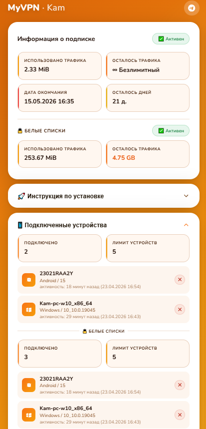
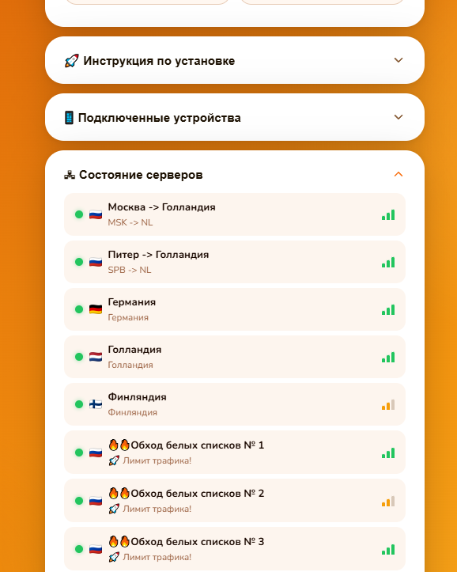
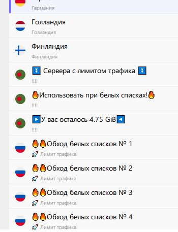
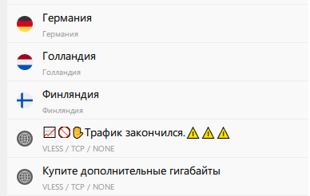
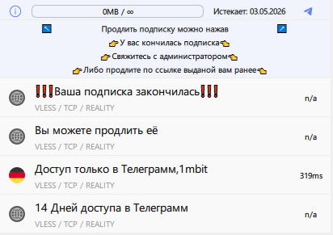

# remna_sub_panel

PHP пользовательская панель для подписок [Remnawave](https://github.com/remnawave).

Открывается в браузере — показывает карточку с информацией о подписке (трафик, срок, устройства).  
Открывается в Happ — проксирует подписку с поддержкой HWID, слияния с WL-подпиской и кастомных заголовков.  
Поддерживает подмену тела подписки для заблокированных/просроченных пользователей.











## Возможности

- Браузерная панель: трафик, срок, статус, HWID-устройства, белые списки
- QR-код текущей страницы подписки в браузерной панели (`show_qr`)
- Блок **«Состояние серверов»** в браузерной панели: онлайн/офлайн, задержка, флаги стран, описание — через xray-checker API
- Проксирование подписки для Happ, INCY и V2RayTun с фильтрацией и переопределением заголовков
- Поддержка форматов подписки: **base64 (text/plain)** и **JSON**
- Слияние основной подписки и WL-подписки (`{shortUuid}{wl_suffix}`) в один ответ (только для активных пользователей), с выбором позиции WL-серверов
- Добавление произвольных серверов в конец списка через конфиг (`add_servers_base64_MAIN` / `add_servers_base64_WL`, только base64)
- Перемешивание серверов основной подписки при каждом запросе (Fisher-Yates, только ACTIVE, не затрагивает WL)
- Подмена тела подписки для LIMITED / DISABLED и ограниченная по времени полная замена для EXPIRED
- Статус-специфичные `announce` — разные объявления для limited / expired / disabled
- Поддержка **внешних чекеров** (xray-checker и др.) — по IP/UA отдают Happ-ответ вместо HTML
- Кнопки оплаты в шапке панели: **«Продлить»** (сайт) и **«Продлить в Телеграмм»** (TG-бот) с настраиваемым URL-шаблоном (`{shortUuid}`, `{userId}`, `{B64:USERNAME}`)
- Удаление HWID-устройств с отдельными лимитами на 24 часа, 7 и 30 дней
- Двухуровневый кэш состояния подписки: APCu и постоянная SQLite-база
- Настраиваемые шаблоны страниц (папка `templates/`)
- Шифрование ссылок через [crypto.happ.su](https://crypto.happ.su)
- Debug-панель для диагностики (доступна только с заданного IP)
- Поддержка Apache (`.htaccess`) и Nginx
- Поддержка eGames панелей - переменная `egames_cookie`

## Требования

- PHP **8.1+** с расширениями `ext-curl`, `ext-mbstring`, `ext-pdo_sqlite`
- Apache или Nginx
- Доступ к панели [Remnawave](https://github.com/remnawave)
- Для HWID-функций и удаления устройств: **API-токен** из Remnawave Dashboard (для других задач токен не нужен! может работать без него). Для scoped-токена Remnawave 3.x нужны права `users:by-username`, `hwid-user-devices:list-by-user` и, если разрешено удаление, `hwid-user-devices:delete`.

## Установка

### 1. Установи PHP
```bash
sudo add-apt-repository universe -y && sudo apt update && sudo apt install -y php php-curl php-mbstring php-sqlite3 php-cli
```

### 2. Скопируй файлы на сервер

```bash
git clone https://github.com/goldns/remna_sub_panel.git /var/www/sub
```

### 3. Создай конфиг

```bash
cd /var/www/sub && cp config.php.example config.php
```

Открой `config.php` и заполни обязательные поля:

```bash
nano config.php
```

```php
'remnawave_url' => 'https://panel.example.com',
'api_token'     => 'ваш_api_токен',  // Remnawave → Settings → API Tokens
```

Создай уникальное имя SQLite-базы минимум из 12 случайных цифр и укажи его в `storage_path`:

```bash
STORAGE_DIGITS=$(tr -dc '0-9' </dev/urandom | head -c 20)
echo "data/cache_${STORAGE_DIGITS}.sqlite"
```

Скопируй выведенный относительный путь в `config.php`. Каталог `data/` создается автоматически и закрыт от
прямого доступа правилами поставляемых конфигураций веб-сервера.

### 4. Настрой веб-сервер

**Nginx** — отредактируй `nginx.conf`, замени `server_name` на свой домен.
Пример ограничивает только динамические PHP-запросы до 5 запросов в секунду на нормализованный клиентский IP с
`burst=10` и ответом `429`; файлы из `/assets/` под этот лимит не попадают.

```bash
nano nginx.conf
```
 
Затем подключи:
```bash
cp nginx.conf /etc/nginx/sites-available/sub
ln -s /etc/nginx/sites-available/sub /etc/nginx/sites-enabled/
nginx -t && systemctl reload nginx
```

> Путь к сокету PHP-FPM по умолчанию: `unix:/run/php/php8.3-fpm.sock`  
> Для другой версии PHP замени на `php8.x-fpm.sock`

**Apache** — `.htaccess` уже лежит в корне, mod_rewrite должен быть включён:

```bash
a2enmod rewrite
systemctl reload apache2
```

### 4. Настройка SSL сертификатов (опционально)
> Перед настройкой нужно добавить DNS запись типа A на IP-адрес вашего сервера. 

**Certbot** — установка certbot. 
```bash
sudo apt install -y certbot python3-certbot-nginx
```

Выпуск сертификата под ваш домен:
```bash
certbot --nginx -d sub.example.com && systemctl restart nginx
```
Если будет выбор - выбирайте 1.

## Конфигурация

Все настройки — в файле `config.php`. Основные параметры:

| Параметр | По умолчанию | Описание |
|---|---|---|
| `remnawave_url` | — | URL панели Remnawave (без слеша в конце) |
| `api_token` | — | API-токен из Remnawave Dashboard |
| `forward_request_headers` | безопасный allowlist | Клиентские заголовки, которые разрешено передавать upstream |
| `forward_response_headers` | безопасный allowlist | Upstream-заголовки, которые разрешено вернуть подписочному клиенту |
| `response_body_limits` | по типу запроса | Максимальный размер полностью распакованного ответа info/user/HWID/checker/subscription/mutation/external |
| `show_version` | `true` | Показывать версию прокси в футере панели |
| `project_name` | `null` | Название в шапке страницы (`null` = скрыть) |
| `show_qr` | `false` | Показывать кнопку QR-кода текущей страницы подписки |
| `allow_delete_hwid` | `false` | `true` = кнопка удаления устройств доступна всем; `false` = только для `debug_ip` |
| `csrf_secret` | `''` | Секрет не короче 32 байт для токена удаления HWID; пусто = удаление полностью отключено |
| `storage_driver` | `'sqlite'` | Драйвер постоянного хранилища; сейчас поддерживается SQLite |
| `storage_path` | — | Путь `data/cache_<12+ случайных цифр>.sqlite` |
| `hwid_delete_limits` | `2 / 4 / 10` | Лимиты успешных удалений за 24 часа / 7 дней / 30 дней; `0` отключает отдельный лимит |
| `copyright` | `null` | Текст копирайта в футере (`{year}` = текущий год, `{project_name}` = название проекта) |
| `encrypt_sub_link` | `true` | Шифровать deeplink через crypto.happ.su |
| `support_url` | `null` | Ссылка на поддержку (Telegram и др.) |
| `lang` | `'ru'` | Язык интерфейса |
| `template` | `'default'` | Папка шаблонов внутри `/templates/` |
| `debug_ip` | `''` | IP/CIDR для доступа к debug-панели (пусто = отключено) |
| `debug_hwid` | `''` | HWID для симуляции Happ-запроса через `?happ` |
| `display_errors` | `false` | Показывать ошибки PHP клиенту |

> При `encrypt_sub_link=true` полный URL подписки, включая её идентификатор, передаётся внешнему сервису.
> Включайте этот режим только после осознанного принятия такого раскрытия данных.

### Кэш состояния подписки

Успешный `/info` сохраняется в SQLite на время `cache_ttl`; APCu при наличии работает поверх SQLite как быстрый
L1-кэш. Безопасный заголовок `support-url` сохраняется вместе с состоянием, поэтому интерфейс одинаков при
ответе API, APCu и SQLite. Тело самой подписки не кэшируется, поэтому регистрация HWID подписочным клиентом продолжает выполняться
на каждом запросе. Просроченное состояние из SQLite никогда не используется как fallback: если API недоступен,
панель и подписочные клиенты получают `503`. При отсутствии APCu система продолжает работать через SQLite.

| Параметр | По умолчанию | Описание |
|---|---|---|
| `apcu_cache` | `true` | Включить APCu-кэш |
| `cache_ttl` | `60` | Время жизни кэша в секундах (`/info`, HWID-запросы) |
| `storage_driver` | `'sqlite'` | Тип постоянного хранилища |
| `storage_path` | — | Уникальный относительный путь к базе внутри `data/` |

Контактные поля `email` и `telegramId` сохраняются только тогда, когда они действительно используются одним из
шаблонов оплаты. Остальные необязательные персональные поля в SQLite не записываются.

> `by-username` кэшируется в 5 раз дольше — числовой ID и лимит устройств меняются редко.

### WL-подписки

Пользователь с суффиксом к shortUuid (`{shortUuid}_WL` по умолчанию) содержит дополнительные серверы. Его тело сливается с основным ответом только тогда, когда статусы основной и WL-подписки подтверждены как `ACTIVE`. При неизвестном статусе, ошибке `/info`, а также LIMITED / EXPIRED / DISABLED WL-тело не запрашивается и не добавляется.

| Параметр | По умолчанию | Описание |
|---|---|---|
| `wl_suffix` | `'_WL'` | Суффикс к shortUuid для WL-пользователя |
| `enable_wl` | `true` | `false` = WL-запрос не делается, тела не сливаются |
| `wl_position` | `'bottom'` | Куда добавлять WL-серверы относительно основных: `'bottom'` = после, `'top'` = перед |
| `wl_headers_forward` | `['subscription-userinfo']` | Заголовки, которые берутся из WL-ответа вместо значений основного пользователя |

Заголовки из `wl_headers_forward` глушатся в ответе основного пользователя и заменяются значением из WL.
Если WL-пользователь не найден или не подтвержден как `ACTIVE`, используется значение основного пользователя.
Недоступность самого API приводит к `503`, без fallback на устаревшие данные. При статусах LIMITED / EXPIRED /
DISABLED WL не делается, всегда берется из main.

Параметр `wl_position` определяет порядок слияния. По умолчанию (`'bottom'`) WL-серверы добавляются после серверов основной подписки. При `'top'` — перед ними. Работает для обоих форматов: text/plain (base64) и JSON.

```php
'wl_position' => 'top',   // WL-серверы будут первыми в списке
```

### Перемешивание серверов

```php
'shuffle_servers' => true,
```

Перемешивает серверы **основной подписки** в случайном порядке перед отправкой клиенту. Работает только для статуса `ACTIVE`. WL-серверы не затрагиваются — они всегда добавляются в конец после перемешанных основных.

Поддерживает оба формата подписки: **text/plain (base64)** и **JSON**.

Алгоритм использует Fisher-Yates с `random_int()` — криптографически стойким источником случайности (`/dev/urandom` на Linux, `CryptGenRandom` на Windows). Каждый запрос клиента получает независимый порядок серверов.

| Параметр | По умолчанию | Описание |
|---|---|---|
| `shuffle_servers` | `false` | `true` = перемешивать серверы основной подписки при каждом запросе |

### Дополнительные серверы

Позволяет дописать собственные серверы в список подписки, не добавляя их в Remnawave. Два независимых списка, каждый элемент — готовая строка конфигурации сервера (`vless://...`, `vmess://...`, `ss://...` и т.п.):

- **`add_servers_base64_MAIN`** — добавляются в конец сегмента основных серверов. Всегда при `ACTIVE`-статусе основного пользователя.
- **`add_servers_base64_WL`** — добавляются в конец сегмента WL-серверов только при подтверждённом `ACTIVE` основной и WL-подписки.

```php
'add_servers_base64_MAIN' => [
    'vless://xxxxx@server.example.com:443?encryption=none&flow=xtls-rprx-vision&type=tcp&security=reality&sni=www.example.com&fp=chrome&pbk=public_key&sid=session_id#Server%201',
    'vless://...#Server 2',
],
'add_servers_base64_WL' => [
    'vless://...#WL Server 1',
],
```

Порядок сегментов `main` / `WL` в итоговом теле определяется ключом `wl_position`. Серверы каждого списка идут сразу за серверами своего сегмента.

> ⚠️ Работают **только для base64-подписки** (`text/plain`). Для JSON-подписки параметры игнорируются.
>
> ⚠️ Работают **только для активной основной подписки**. При статусах LIMITED / EXPIRED / DISABLED дополнительные серверы не добавляются.

| Параметр | По умолчанию | Описание |
|---|---|---|
| `add_servers_base64_MAIN` | `[]` | Серверы в конец сегмента основных (при ACTIVE основного пользователя) |
| `add_servers_base64_WL` | `[]` | Серверы в конец сегмента WL (только при ACTIVE WL-пользователя) |

### Подмена тела при неактивных статусах

Для неактивного пользователя можно настроить отдельную подменную подписку. При LIMITED и DISABLED её тело сливается с оригинальным. При EXPIRED тело полностью заменяется на `user_expired`, но только внутри положительного grace-периода. Заголовки (трафик, срок) остаются от оригинала, WL не применяется.

| Параметр | Статус | Описание |
|---|---|---|
| `user_limited` | `LIMITED` | Трафик закончился |
| `user_expired` | `EXPIRED` | Полная замена тела внутри положительного grace-периода |
| `user_disabled` | `DISABLED` | Отключён администратором |

Значение — **shortUuid** подменного пользователя. Пустая строка `''` = подмена отключена, тело отдаётся как есть.

```php
'user_limited'  => 'abc123',
'user_expired'  => 'abc123',
'user_disabled' => 'abc123',
```

#### Grace-период для EXPIRED

Параметр `expired_grace_days` ограничивает срок полной замены тела на `user_expired`:

| Значение | Поведение |
|---|---|
| `0` | Подмена EXPIRED отключена |
| `N` | Полная замена в течение N дней после времени окончания подписки |

Дата истечения берётся только из `response.user.expiresAt` валидного ответа `/info`. Если поле отсутствует или имеет неверный формат, подмена не применяется. После N дней возвращается исходное тело без WL и дополнительных серверов.

```php
'user_expired'       => 'abc123',
'expired_grace_days' => 30,   // полная замена 30 дней после expiresAt, затем оригинальное тело
```

### Статус-специфичные announce

Для каждого неактивного статуса можно задать отдельный текст объявления в Happ. Перекрывает глобальный `announce`.

| Параметр | Статус | Описание |
|---|---|---|
| `announce_limited` | `LIMITED` | Объявление когда трафик закончился |
| `announce_expired` | `EXPIRED` | Объявление когда срок истёк |
| `announce_disabled` | `DISABLED` | Объявление когда пользователь отключён |

```php
'announce_limited'  => 'Трафик закончился. Продлите подписку.',
'announce_expired'  => 'Подписка истекла. Обратитесь к администратору.',
'announce_disabled' => null,  // null = использовать глобальный announce
```

Логика: `null` = не переопределять | `''` = удалить заголовок | `'строка'` = заменить.

### QR-код

Если `show_qr` включен (`true`), в шапке браузерной панели появляется кнопка QR. Она открывает небольшое модальное окно с затемнением страницы.

QR-код генерируется в браузере и кодирует полный текущий URL, по которому пользователь открыл панель. Например, для:

```text
https://sub.example.com/uu-p-0v4jJSMQEX-
```

в QR будет записан именно этот адрес. Генерация локальная, без внешних API.

### Поддерживаемые клиенты

Клиенты определяются по `X-HWID` или известному `User-Agent` и получают ответ подписки через Happ-совместимый обработчик. `X-HWID` имеет приоритет, потому что Happ позволяет заменить `User-Agent` на произвольный:

| Клиент | User-Agent |
|---|---|
| Happ | `Happ/{version}/{platform}` |
| Happ/Xray core | `xray` |
| INCY | `INCY/*` |
| V2RayTun | `v2raytun/*` |

Для этих клиентов требуется заголовок `X-HWID`; без него запрос с известным клиентским `User-Agent` вернёт `403`. Запрос с `X-HWID` обрабатывается как подписочный независимо от `User-Agent`.

### Кнопки оплаты

В шапке браузерной панели можно показать до двух кнопок оплаты. Кнопки располагаются под названием проекта и именем пользователя, в одном ряду с кнопками QR и Telegram:

```
MyVPN · username
[ Продлить ]  [ Продлить в Телеграмм ]  [ QR ]  [ TG ]
```

| Параметр | Кнопка | Описание |
|---|---|---|
| `payment_url` | **Продлить** | Ссылка на сайт оплаты |
| `payment_url_tg` | **Продлить в Телеграмм** | Ссылка на Telegram-бота оплаты |

Пустая строка — соответствующая кнопка скрыта. Оба параметра независимы, можно использовать один или оба.

> При переходе на Remnawave 3.x обязательно замените прежний `{uuid}` на `{userId}`
> и убедитесь, что платёжный обработчик принимает числовой ID. Старое поле UUID пользователя
> удалено из API; URL с `{uuid}` считается несовместимым, и кнопка не отображается.

В шаблоне URL поддерживаются плейсхолдеры:

| Плейсхолдер | Описание |
|---|---|
| `{shortUuid}` | shortUuid пользователя из URL подписки |
| `{userId}` | Числовой ID пользователя Remnawave 3.x (требует `api_token`) |
| `{B64:USERNAME}` | Стандартный Base64 разрешённого поля, затем percent-кодирование для безопасной вставки в URL |

Имена B64-полей регистронезависимы. Разрешены `ID`, `USERNAME`, `EMAIL`, `TELEGRAMID`, `STATUS`, `USERSTATUS`,
`EXPIRESAT`, `DAYSLEFT`, `TRAFFICUSED`, `TRAFFICUSEDBYTES`, `TRAFFICLIMIT`, `TRAFFICLIMITBYTES` и
`HWIDDEVICELIMIT`. Неизвестный плейсхолдер скрывает кнопку вместо формирования частично неверного URL.

Примеры:
```php
'payment_url'    => 'https://pay.example.com/pay/{shortUuid}',
'payment_url_tg' => 'https://bot.example.com/start/{B64:USERNAME}',
```

### Переопределение заголовков Happ

Параметры `forward_request_headers` и `forward_response_headers` задают явные списки заголовков, которые можно
передавать через прокси. Клиентские Cookie, авторизация, forwarding/identity-заголовки и транспортные заголовки
не передаются; `Authorization`, настроенный Cookie, `X-Forwarded-For` и заголовки запрета кэша формируются самим
приложением. В ответе всегда запрещены `Cookie`, `Set-Cookie`, auth/proxy-auth и служебные транспортные заголовки.
Запрещённые имена нельзя включить ни этими списками, ни через `custom_headers`.

Параметр `profile_title_prefix`:
- `null` — пропустить `Profile-Title` из Remnawave без изменений
- `'строка'` — декодировать `Profile-Title`, добавить строку перед названием и закодировать обратно в `base64:...`
- Разделитель добавляется прямо в значение, например `'MyVPN '` или `'MyVPN | '`
- Можно использовать `{project_name}`, например `'{project_name} | '`

Параметры `support_url`, `announce`, `profile_update_interval`, `content_disposition_name`:
- `null` — пропустить значение Remnawave без изменений
- `'строка'` — заменить своим значением
- `''` — удалить заголовок полностью

Параметр `happ_routing` — routing-профиль (`null` = не переопределять):
- Полный URL вида `happ://routing/add/{base64}` или `happ://routing/onadd/{base64}`
- **text/plain подписка** — вставляется первой строкой в тело
- **JSON подписка** — передаётся заголовком `routing`
- Заголовок `routing` от Remnawave при этом подавляется автоматически

### Кастомные заголовки

```php
'custom_headers' => [
    'ping-type'     => 'proxy',
    'hide-settings' => 1,
    // ...
],
```

Отправляются **только Happ-клиентам**, браузер их не получает.

### Удаление HWID-устройств

Браузерная панель показывает список зарегистрированных устройств. Кнопка удаления отображается в зависимости от `allow_delete_hwid`:

- `false` (по умолчанию) — кнопка видна только с IP из `debug_ip`
- `true` — кнопка доступна всем пользователям

Для работы функции обязателен `api_token`.

Также задайте отдельный `csrf_secret` длиной не менее 32 байт. Каждое удаление требует подтверждения в браузере
и подписанного токена со сроком 10 минут. При пустом или слишком коротком `csrf_secret` кнопки удаления скрыты,
а сервер отклоняет операцию независимо от `allow_delete_hwid` и `debug_ip`.

Успешные удаления считаются отдельно для каждого фактического API `username`, поэтому основная и WL-учетная
запись имеют независимые лимиты. По умолчанию разрешено 2 удаления за последние 24 часа, 4 за 7 дней и 10 за
30 дней; операция блокируется, если исчерпан любой ненулевой лимит. Неуспешные и заблокированные попытки
сохраняются в журнале, но лимит не расходуют. Для адресов из `debug_ip` ограничения не применяются, их удаления
не уменьшают квоту обычного пользователя, однако CSRF-проверка и аудит сохраняются. Перед подтверждением панель
показывает устройство и остаток каждого лимита.

Перед удалением сервер заново получает пользователя и список устройств, находит точный HWID и сохраняет в аудит
только подтверждённые API сведения. Браузер отправляет лишь HWID, роль main/WL и CSRF-токен. Если API недоступен,
операция возвращает `503` и удаление не отправляется. Незавершённая запись аудита бессрочно занимает квоту; после
60 секунд следующий запрос сверяет её со свежим списком устройств и завершает как успешную или неуспешную.
Если upstream уже подтвердил удаление, а SQLite дважды не смог завершить аудит, клиент получает успешный ответ с
предупреждением, а операция остаётся в pending до последующей сверки.

SQLite обязателен именно для изменяющей операции: если база недоступна, удаление возвращает `503`. Обычные
неизменяющие маршруты при недоступном SQLite обращаются к API напрямую; при недоступности самого API также
возвращается `503` без выдачи устаревшего кэша.

### Шаблоны

Для создания своей темы скопируй `templates/default/` в `templates/my-theme/` и укажи в конфиге:

```php
'template' => 'my-theme',
```

Папка должна содержать те же 5 файлов: `user-panel.php`, `error-page.php`, `debug-panel.php`, `happ-debug.php`, `install-guide.php`.

### Состояние серверов (xray-checker)


Блок отображается в браузерной панели под остальными карточками. Если API не ответил за `checker_timeout` секунд — блок полностью скрывается. Для каждого сервера показываются: флаг страны, название, описание (из base64 в имени), индикатор сигнала.

| Параметр | По умолчанию | Описание |
|---|---|---|
| `checker_url` | `''` | URL xray-checker API (`/api/v1/proxies`). Пусто = скрыть блок |
| `checker_timeout` | `2` | Таймаут запроса к API в секундах |
| `checker_hide_servers` | `[]` | IP-адреса серверов, которые не показывать |
| `checker_latency_good` | `500` | Порог «отлично» (мс) — 3 зелёных столбика |
| `checker_latency_ok` | `1000` | Порог «средне» (мс) — 2 жёлтых; выше = 1 красный |

### Внешние чекеры подписок

Позволяет внешним системам мониторинга (xray-checker, uptime-kuma и др.) получать Happ-ответ вместо HTML-панели. Идентификация по IP и/или User-Agent. Чекер получает `debug_hwid` как HWID и Happ User-Agent.

```php
'checkers' => [
    ['ip' => '1.2.3.4', 'ua' => 'Xray-Checker'],
    ['ip' => ['192.0.2.10', '198.51.100.0/24']],  // только IP
    ['ua' => 'MyMonitor'],                        // только UA
],
```

| Поле | Описание |
|---|---|
| `ip` | Строка или массив IP/CIDR. Не указано = не проверять |
| `ua` | Подстрока User-Agent (регистрозависимо). Не указано = не проверять |

Оба указанных условия должны совпасть (AND).
Пустая запись и запись без непустого `ip` или `ua` всегда отклоняются и не включают checker-режим.

## Структура URL

```
https://sub.example.com/{shortUuid}
```

- Браузер → панель пользователя
- X-HWID с любым User-Agent → подписка (JSON или base64 — зависит от настроек Remnawave)
- Happ с известным User-Agent, но без X-HWID → 403
- Xray (`User-Agent: xray`) без X-HWID → 403
- V2RayTun (`User-Agent: v2raytun/*`) + X-HWID → тот же ответ, что для Happ
- V2RayTun без X-HWID → 403
- Браузер + `?happ` (с debug_ip) → симуляция Happ-запроса
- Совпадение с `checkers` → Happ-ответ (без HWID-проверки)

Прокси принимает только корректный `text/plain` с Base64-телом или JSON-список. JSON-объекты и массивы со
смешанными ключами отклоняются до перемешивания и слияния. Неожиданный MIME, повреждённое
тело и несовместимый формат обязательной подмены дают `502`. Подтверждённый ответ «не найдено» даёт `404`,
недоступность upstream и сетевой таймаут — `503`. Если `/info` не подтверждает известный статус,
возвращается только исходная валидная подписка без WL, перемешивания, подмен и дополнительных серверов.

HTML-панель использует только локальные стили, скрипты и системный шрифт. Флаги стран формируются локально, а
базовые cache/security-заголовки и CSP с nonce применяются ко всем динамическим ответам. Ошибки транспорта и
SQLite пишутся в защищённый PHP error log только как категория, HTTP/cURL-код и длительность — без URL, токенов,
Cookie, HWID и тел ответов.

## Автор

Автор готов доработать панель под ваш запрос.

Контакты: [@kamgoldns](https://t.me/kamgoldns)

## Лицензия

MIT
